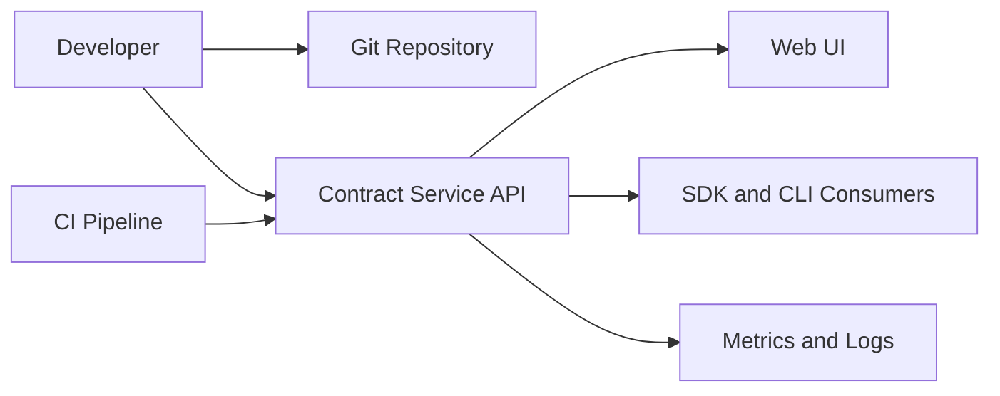
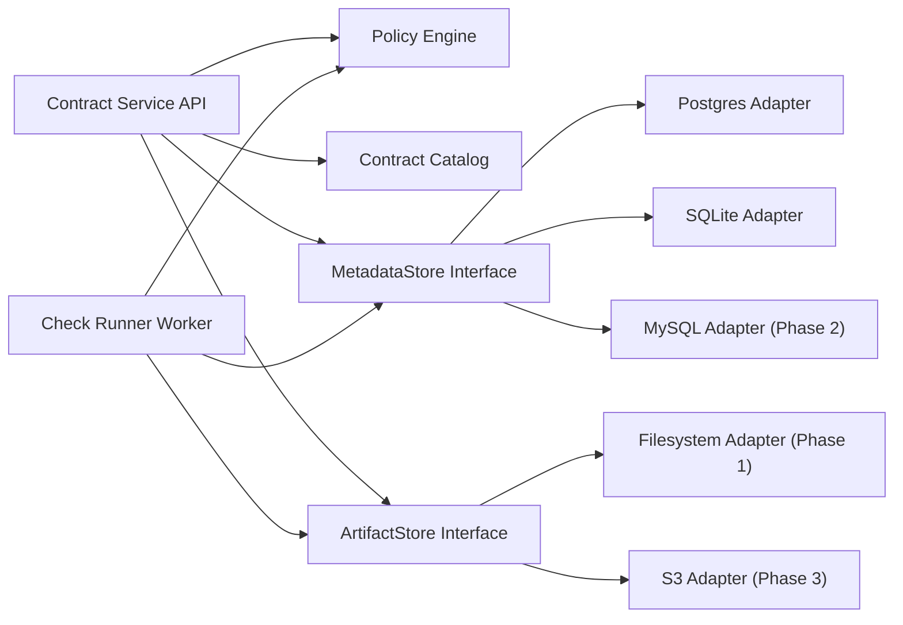

# Architecture v3 - Data Contract Governance

- Version: `v3`
- Date: `2026-03-25`
- Status: `Planning baseline (no implementation changes in this document)`
- Authors: `DCG maintainers`

## 1. Purpose
Define the production architecture path across four phases:
1. Postgres primary production baseline, SQLite local dev plus production-lite, Docker/Compose demo.
2. MySQL support behind a clean metadata store interface.
3. S3 support for contract artifact storage.
4. MongoDB only if validated demand exists.

This document supersedes older system-level planning for new implementation work, while preserving historical docs (`SystemDesign.md`, ADR v1 set).

## 2. Design Principles
1. Git-first governance: contract changes remain PR-driven and auditable.
2. Interface-first persistence: storage engines are adapters, not hardwired logic.
3. Postgres-first production: optimize one production path before multi-backend expansion.
4. SQLite production-lite support: explicitly supported with clear constraints.
5. Backward-compatible API evolution: no breaking API changes without versioning policy.
6. Observable by default: metrics, logs, traces, and runbooks are first-class requirements.

## 3. Goals and Non-Goals

### 3.1 Goals
1. Prevent breaking contract changes before deployment.
2. Provide a low-friction local experience and a reliable production path.
3. Support phased backend expansion without major rewrites.
4. Enable public adoption through reproducible demos and clear docs.

### 3.2 Non-Goals (for v3 plan horizon)
1. Runtime payload interception in Kafka brokers or API gateways.
2. Multi-region active-active control plane.
3. MongoDB as a guaranteed backend in early phases.

## 4. Target Users
1. Platform teams owning CI governance policies.
2. Backend teams shipping API or event schema changes.
3. Data platform teams managing schema evolution and auditability.

## 5. Context View


## 6. Component Architecture


## 7. Core Interfaces

### 7.1 MetadataStore (transactional metadata)
Scope:
1. `check_runs`
2. `check_run_logs`
3. `audit_logs`
4. queue-claim and state transitions

Design contract:
```java
public interface MetadataStore {
  CheckRunCreateResponse createQueuedRun(CheckRunCreateRequest request);
  Optional<QueuedCheckRun> claimNextQueuedRun();
  boolean completeRun(String runId, String status, List<String> breakingChanges, List<String> warnings);
  boolean requeueRun(String runId);
  void appendLog(String runId, String level, String message);

  List<CheckRunResponse> listRuns(String contractId, String commitSha);
  CheckRunPageResponse listRunsPage(CheckRunQuery query);
  Optional<CheckRunResponse> findRunById(String runId);
  List<CheckRunLogResponse> listRunLogs(String runId);

  void recordAuditLog(AuditLogEntry entry);
  HealthSnapshot health();
}
```

### 7.2 ArtifactStore (contract artifacts)
Scope:
1. `metadata.yaml`
2. `vN.json` schema files
3. contract-level listing and version reads

Design contract:
```java
public interface ArtifactStore {
  List<String> listContracts();
  Optional<ContractMetadata> readMetadata(String contractId);
  List<String> listVersions(String contractId);
  Optional<JsonNode> readSchema(String contractId, String version);

  void createContract(CreateContractRequest request);
  void createVersion(String contractId, CreateContractVersionRequest request);
}
```

## 8. Storage Support Matrix

| Capability | Phase 1 | Phase 2 | Phase 3 | Phase 4 |
|---|---|---|---|---|
| Postgres metadata | Primary production | Primary production | Primary production | Primary production |
| SQLite metadata | Local dev + production-lite | Same | Same | Same |
| MySQL metadata | Not supported | Supported (beta to GA) | Supported | Supported |
| Filesystem artifacts | Default | Default | Optional | Optional |
| S3 artifacts | Not supported | Not supported | Supported | Supported |
| Mongo metadata | Not supported | Not supported | Not supported | Decision gate only |

## 9. SQLite Production-Lite Baseline

Supported when:
1. Single-node deployment.
2. Low/moderate write concurrency.
3. Local disk (not shared network filesystem).

Required controls:
1. `WAL` mode enabled.
2. Configured `busy_timeout`.
3. Startup integrity check and migration check.
4. Automated backups with restore verification.
5. Clear docs: no horizontal write scaling, no multi-writer cluster.

Not recommended when:
1. Multi-instance write workloads.
2. High write throughput or large concurrent runner fleets.
3. HA requirements demanding automatic failover.

## 10. Phase Architecture Details

### 10.1 Phase 1: Production Baseline
Scope:
1. Postgres production path hardening.
2. SQLite local dev plus production-lite hardening.
3. Docker/Compose demo profile.

Exit criteria:
1. Postgres runbooks: backup, restore, migration rollback.
2. SQLite production-lite runbook and limitations published.
3. End-to-end demo under 10 minutes from clean machine.
4. SLO dashboard and alerting baseline in place.

### 10.2 Phase 2: MySQL Metadata Adapter
Scope:
1. `MetadataStore` MySQL adapter.
2. SQL dialect parity tests for query and queue semantics.
3. Flyway migration strategy for MySQL.

Exit criteria:
1. CI integration matrix: Postgres, SQLite, MySQL.
2. Behavior parity tests pass for run lifecycle and pagination.
3. MySQL docs and sizing guidance published.

### 10.3 Phase 3: S3 Artifact Adapter
Scope:
1. `ArtifactStore` S3 adapter.
2. Object key versioning strategy.
3. Secure IAM policy templates.

Exit criteria:
1. Read and write contract flows work with S3-backed artifacts.
2. Fallback local filesystem profile remains unchanged.
3. Encryption and bucket policy defaults documented.

### 10.4 Phase 4: Mongo Decision Gate
Scope:
1. Demand validation, not immediate implementation.
2. Evaluate fit for specific read models or analytics projections.

Go criteria:
1. Verified user demand from production adopters.
2. Clear technical reason not solved by Postgres or MySQL.
3. Dedicated owner and maintenance commitment.

## 11. Data Model Baseline

Canonical entities:
1. `check_runs`
2. `check_run_logs`
3. `audit_logs`
4. contract artifacts (`metadata.yaml`, `vN.json`) in `ArtifactStore`

Run lifecycle states:
1. `QUEUED`
2. `RUNNING`
3. terminal states (`PASS`, `FAIL`, plus future extensible states)

Idempotency anchor:
1. `input_hash` for duplicate detection and operational diagnostics.

## 12. Deployment Profiles

### 12.1 Local Developer
1. SQLite metadata.
2. Filesystem artifacts.
3. Optional single process runner.

### 12.2 Demo (Docker Compose)
1. API + runner + Postgres + seeded contracts.
2. One-command start and deterministic sample flow.

### 12.3 Production-Lite
1. Single API instance + SQLite + local persistent volume.
2. Explicitly no multi-writer HA claims.

### 12.4 Production Standard
1. API replicas + runner replicas.
2. Postgres primary with managed backups and restore drills.
3. Filesystem or S3 artifacts based on phase readiness.

## 13. Security and Compliance Baseline
1. Role-based authorization for write endpoints.
2. Structured audit logs for create/update/check actions.
3. Secret injection via environment or secret manager, never in repo.
4. Transport security for database and object storage connections.
5. Dependency and container vulnerability scanning in CI.

## 14. Reliability and Observability
1. Health checks for API, metadata store, and runner loop.
2. Metrics:
   - check queue depth
   - run latency percentiles
   - store error rate
   - API error codes by route
3. Correlated logs with `request_id` and `run_id`.
4. Alerts:
   - queue backlog thresholds
   - repeated migration failures
   - database connectivity degradation

## 15. Public Adoption and Feedback Loop
1. Publish roadmap and architecture summary in GitHub Discussions.
2. Post practical use-case demos on Reddit and X.
3. Use weekly changelog cadence and issue triage ritual.
4. Capture top user requests and map them to phase backlog.

## 16. Risks and Mitigations
1. Risk: backend expansion causes regressions.
   Mitigation: adapter contract tests and CI matrix.
2. Risk: SQLite perceived as full HA production backend.
   Mitigation: explicit production-lite labeling and docs.
3. Risk: too many backend commitments too early.
   Mitigation: strict phase gates and demand validation.
4. Risk: low adoption despite feature work.
   Mitigation: problem-first demos and feedback-driven prioritization.

## 17. Weekwise Plan Snapshot
1. Weeks 1-2: research and architecture freeze.
2. Weeks 3-7: Phase 1 implementation and release.
3. Weeks 8-10: Phase 2 implementation and stabilization.
4. Weeks 11-13: Phase 3 implementation and stabilization.
5. Week 14: Phase 4 decision gate.

## 18. Open Questions
1. Default artifact backend in production standard after Phase 3: filesystem or S3?
2. MySQL support level at launch: beta or full GA?
3. Required SLO targets for first external production adopters?
4. Mongo decision criteria thresholds (number of requests, tenant profile, workload type)?

## 19. Approval Checklist
1. Architecture review completed.
2. Support matrix approved.
3. Phase exit criteria accepted.
4. Public roadmap messaging aligned with implementation scope.
