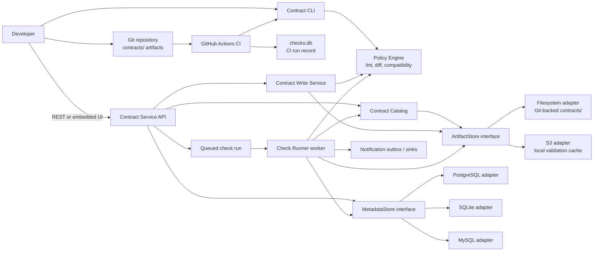

# System Design — Data Contract Governance

## 1. Problem Statement

When one team changes an event or API payload, another team may still depend on the previous shape. A field removed from an event, a changed type, or a new required field can break consumers only after deployment. The developer needs a fast, repeatable way to detect that compatibility problem while proposing the schema change—not after an integration fails.

This project governs **versioned JSON Schema contracts** stored with application code. It is intentionally narrow:

- It checks schema evolution and records the decision; it does not validate every runtime message in a broker, gateway, or application.
- It supports JSON Schema, rather than attempting to be a universal registry for Avro, Protobuf, database migrations, and API approvals.
- It uses Git pull requests and CI as the enforcement point, rather than introducing a separate enterprise workflow system.

It is for backend teams that publish or consume JSON events or APIs, and for platform or data-governance teams that define the compatibility policy. Contract authors use the CLI and pull request checks; maintainers use the service, UI, and check history to inspect the current contract and the reason for a decision.

## 2. Alternative Solutions Considered

| Approach | Why it was not selected |
| --- | --- |
| Runtime interception in a message broker or API gateway | It can reject invalid traffic at runtime, but requires integration with production infrastructure and adds latency and operational risk. This project is a pre-deployment control plane: it prevents known breaking changes earlier in the delivery process. |
| Database-first schema registry | A central registry can be useful at larger scale, but making it the authoring source would duplicate Git history and pull-request review. Here, versioned files remain the reviewable source of truth; stores hold operational metadata and optionally the artifacts. |
| Custom checks in each repository's CI script | Teams could write their own comparison logic, but semantics would drift and check history would be fragmented. A shared CLI and policy engine provide one deterministic result locally, in CI, and through the service. |

The selected approach is Git-first contract files, a shared Java validation engine, and an optional service for cataloging contracts and recording asynchronous checks.

## 3. Architecture Overview

The architecture separates contract definitions from operational records. A **contract artifact** is `metadata.yaml` plus immutable versioned JSON Schema files such as `v1.json` and `v2.json`. **Metadata** is the operational data produced while governing those artifacts: check runs, execution logs, audit events, and notification delivery state.

In the current demo deployment, the Contract Service API, Contract Catalog, and Check Runner are Spring Boot components that can run together. Their boundaries are kept explicit so the runner and stores can be deployed or scaled independently when needed.

### Contract Service API

The Spring Boot API is the entry point for applications, the embedded UI, and automation.

- `GET /contracts` and related version endpoints expose cataloged metadata and schemas.
- `POST /contracts` creates a contract and its first version; `POST /contracts/{contractId}/versions` adds the next version. The write service lints the artifact and, in strict mode, rejects a breaking new version before keeping it.
- `POST /checks` accepts an asynchronous compatibility request and returns a queued run. Read endpoints return individual runs, logs, filters, and paginated history.
- Writes create audit records. Health, metrics, and operational-status endpoints expose whether the API's dependent stores are available.

### Policy Engine

`contract-core` is the shared policy engine used by the CLI, synchronous write validation, and the runner. It parses JSON Schema, validates contract structure, creates a semantic diff, and evaluates rules.

Compatibility mode specifies the direction of the check:

- `BACKWARD`: the candidate must continue accepting payloads valid for the prior version.
- `FORWARD`: the prior version must tolerate payload semantics from the candidate.
- `FULL`: both directions must pass.

A policy pack specifies the severity of each detected change—`BREAKING`, `WARNING`, or `IGNORE`. The baseline pack treats removed fields, type changes, newly required fields, and removed enum values as breaking; an added enum value is a warning. A result is `FAIL` if any applicable rule is breaking, otherwise `PASS` with any warnings retained.

### Contract Catalog

`ContractCatalogService` presents artifacts as contract summaries, details, versions, and schemas. It reads through `ArtifactStore`, resolves the configured policy-pack name, and keeps an in-memory cache. The cache refreshes when an artifact's modification time changes or after a successful write, so the catalog is a read model rather than a second source of truth.

### MetadataStore Interface

`MetadataStore` is the persistence boundary for operational records. Its implementation, `CheckRunStore`, owns queue claims and state transitions, check runs and their logs, audit logs, notification-outbox records, query pagination, and store health.

The same store contract is used with these JDBC configurations:

- **PostgreSQL**: the standard shared-production metadata path.
- **SQLite**: local development and single-node production-lite deployments; it is not intended for multi-writer high availability.
- **MySQL**: a supported shared metadata option.

Flyway applies the database-specific migrations. Keeping persistence behind this interface means the API and runner do not need database-specific queue or query logic.

### ArtifactStore Interface

`ArtifactStore` owns contract definition artifacts, not check history. It lists contracts and versions, reads metadata and schemas, writes new contracts and versions, provides safe artifact references, and reports read availability.

- **Filesystem adapter**: the default for local development and demos. Artifacts reside in the Git-backed `contracts/` directory.
- **S3 adapter**: stores the same logical objects in S3, using a local cache for schema paths used by validation. It verifies stored schema checksums and can use the filesystem adapter as a configured fallback.

Both adapters preserve the contract layout: `<contractId>/metadata.yaml` and `<contractId>/vN.json`.

### Check Runner Worker

`CheckRunner` is a scheduled worker that polls the metadata queue (five seconds by default), claims a queued run, loads the contract and policy pack, resolves the two schemas through `ArtifactStore`, and invokes the policy engine. It persists `PASS` or `FAIL`, the breaking-change list, warnings, and execution logs. Transient execution failures are requeued up to the configured retry limit; then the run is finalized as `FAIL` with an execution warning. A failed compatibility check can also publish an operational notification through the persisted notification outbox.

## 4. CI Flow

GitHub Actions runs on every pull request and on pushes to `main` and `master`.

1. The workflow checks out the complete Git history, installs Java 21, and runs the Maven test suite.
2. It packages the CLI as an executable jar.
3. It determines the base and head commit for the pull request or push, then runs `scripts/ci/check-changed-contracts.sh`.
4. The script finds changes beneath `contracts/`, groups them by contract directory, and skips the job when no contract changed.
5. For each changed, still-present contract directory, it runs `contract lint`. If at least two schema versions exist, it compares the last two version files with `contract check-compat`.
6. The check currently runs in `BACKWARD` mode and records its result against the head commit in `checks.db`. A non-zero CLI result makes the GitHub Actions job fail, which can be used as a pull-request protection check.

This flow limits validation to contracts affected by the change while retaining the same lint and compatibility engine used outside CI.

## 5. Contract Validation

Validation has three layers:

1. **Structural validation (lint):** verifies the contract directory, `metadata.yaml`, sequential version filenames, JSON parsing, required metadata, supported compatibility mode, and each JSON Schema.
2. **Semantic comparison:** reads a base and candidate schema and identifies field additions and removals, type changes, required-field changes, and enum additions and removals.
3. **Policy decision:** applies the contract's compatibility mode and resolved policy pack to the diff, returning a deterministic `PASS` or `FAIL` plus evidence.

The same pipeline is reachable in three ways:

- A developer runs `contract lint`, `contract diff`, or `contract check-compat` locally.
- CI runs lint and compatibility checks for changed contract folders before merge.
- The service validates a newly submitted version immediately; in strict mode a failed result rolls the artifact write back. Separately, a `POST /checks` request enters the queue and the Check Runner records the end-to-end result asynchronously.

The result includes the contract ID, base and candidate versions, compatibility mode, commit SHA when supplied, status, breaking changes, warnings, timestamps, and a run ID. This makes a pass or failure traceable to its inputs.

## 6. Contract Authoring

A contract is a folder named with a lowercase dot-separated ID. It contains `metadata.yaml` and sequential schemas named `v1.json`, `v2.json`, and so on. The metadata identifies the owning team, business domain, check direction, and optional policy pack.

Example: a team introduces an `orders.created` event. `v2.json` adds an optional `currency` field and an enum value; under the baseline policy, this passes with a warning for the enum addition.

```text
contracts/
  orders.created/
    metadata.yaml
    v1.json
    v2.json
```

```yaml
# contracts/orders.created/metadata.yaml
ownerTeam: platform
domain: commerce
compatibilityMode: BACKWARD
policyPack: baseline
```

```json
// contracts/orders.created/v2.json
{
  "$schema": "https://json-schema.org/draft/2020-12/schema",
  "type": "object",
  "properties": {
    "orderId": { "type": "string" },
    "status": {
      "type": "string",
      "enum": ["CREATED", "PAID", "SHIPPED"]
    },
    "amount": { "type": "number" },
    "currency": { "type": "string" }
  },
  "required": ["orderId", "status"]
}
```

Before opening a pull request, the author can run:

```bash
contract lint --path contracts/orders.created
contract check-compat \
  --base contracts/orders.created/v1.json \
  --candidate contracts/orders.created/v2.json \
  --mode BACKWARD
```

For a contract already managed by the service, the author can instead submit the next version through `POST /contracts/orders.created/versions`; the service enforces the version sequence, lints it, and performs the compatibility check before accepting it in strict mode.

## 7. Component Architecture and Data Flow


